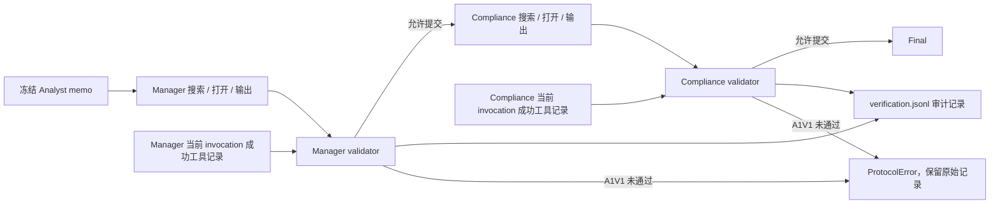

# Validator v2：在现有 track 上强化强制核验

这一版是确定性的程序检查，接在 Manager 和 Compliance 各自输出之后、结果写入 workflow state 之前。两个节点分别核验；不增加 LLM 角色、语义评审或反馈修改轮次。

## 三处强化

1. **逐条检索可复核**：A1V0 / A1V1 都记录每个 policy 目标条款匹配到的成功搜索 query。没有匹配的目标条款也必须记录，不能因为 V0 不强制而省略。
2. **逐条引用核对打开记录**：在报告的 `opened_paragraph_ids` 和 `inherited_source_ids` 中，所有段落引用均须由当前节点、当前 invocation 成功打开。补上“打开了 A，但同时依赖没有自己打开的 B，也能放行”的漏洞。模型声称打开、搜索摘要、上游节点打开、其他 invocation 打开或失败的打开调用都不算。
3. **完整通过单独报告**：`status=verified` / `derived_basis=self_checked` 沿用“打开过至少一个原文段落”的旧含义。新增 `validation_pass` 表示整套程序检查通过；不能用旧 status 代替它。

## A1V0 和 A1V1 的区别

两个条件调用同一个 `evaluate_verification`，计算相同的 `audit_failures`。A1V0 允许继续，`failures` 保持为空；A1V1 把审计缺项写入 `failures`，在该节点结果应用之前终止。`satisfied` 仍表示条件是否允许放行，因此 V0 的 `satisfied=True` 并不代表完整核验通过。

| 场景 | validation_pass | A1V0 | A1V1 |
| --- | --- | --- | --- |
| 所有目标搜索、所有引用段落打开、其余协议检查通过 | true | 放行 | 放行 |
| 只打开一段，另一引用段落未打开 | false | 记录缺项并放行 | 记录缺项并终止 |
| 有打开记录，但漏搜一个目标 | false | 记录缺项并放行 | 记录缺项并终止 |
| A0V0，没有 source access | null | 不适用 | 不属于正式矩阵 |
| 旧日志没有 v2 字段 | null | 未按新版评估 | 未按新版评估 |

沿用的检查包括：policy rule 正确、使用了工具、至少报告一项实际打开的证据、段落属于当前合同、来源可追溯、声明 `self_checked` 且声明与 ledger 一致。

`inherited_source_ids` 的 schema 含义是“依赖上游来源而未自行打开”，所以这里的段落 ID 是被依赖的引用，并不是中性备注。A1V1 需要重开这些段落；推荐模型把自己重开的段落填入 `opened_paragraph_ids`。原 memo / handoff 中的来源记录仍在原始输入日志中保留。非段落形状的上游标识只检查 observed，不当作当前节点已打开的原文证据。

## 具体匹配规则与边界

- category / query 按大小写和标点归一化为字词序列，query 中须包含完整且连续的 category 名称；不做同义词或语义推断。一个 query 同时包含两个完整名称，可以满足两个目标的搜索检查。
- 搜索返回零结果也算已执行搜索，但不能因此断言条款 absent。沿用原 gate 的“至少有一项打开并引用的证据”要求。
- 当前节点的 ledger 在每次 invocation 开始时重置；只在成功工具调用后更新。`replay_ledger` 新增可选 `invocation` 过滤，离线复核时须同时限定 node 和 invocation。
- “来源属于当前合同且打开记录可追溯”是程序出处检查，不是法律合规判断。程序不判断引用是否在语义上充分支持结论，也不读 gold 或判断业务答案正确与否。
- 不修改冻结 policy、E0/E1 memo、gold、prompt、模型配置、工具预算或修订轮次。

## 输出与版本隔离

新版 `verification.jsonl` 每条记录新增：

| 字段 | 含义 |
| --- | --- |
| `validator_version` | `validator_v2`；旧日志读回为 null |
| `validation_pass` | 完整程序检查是否通过；不适用或旧日志为 null |
| `audit_failures` | V0 / V1 同标准检查发现的缺项 |
| `target_search_audit` | 每个目标条款以及匹配的成功 query |
| `citation_audit` | 每个来源 ID、报告字段、自行打开 / 当前合同 / 可追溯事实 |
| `actual_opened_paragraph_ids` | 工具 ledger 的实际打开列表，与模型声明分开 |

评分 JSONL / CSV 新增两个节点的 `validation_pass`、`validator_versions`、`verification_audit_failures`。condition summary 新增两个节点完整通过率，分子 / 分母显式报告；没有到达节点、A0 和历史日志不进入该通过率分母。必须同时报告计划数、尝试数、完成数与失败数，不能把仅已评估节点的通过率称为全部运行的成功率。

旧 raw、score 和 main_v1 manifest 不回写，不把旧 `verified` 追认为 v2 通过。新运行使用独立 experiment ID / 输出目录，避免 resume 时混入旧 gate 的结果。

## 验证方式

先用 synthetic / scripted 边界测试检查应放行和应拦截的路径，再跑完整离线 suite，最后用冻结正式 registry 的一个案例跑 E0/E1 × A0V0/A1V0/A1V1 六格真实模型 smoke。该 smoke 检查接入、日志与 gate，不是新版方法有效性的实验结论。测试结果另存于本次实现报告。

历史 trace 审计可以另产出 sidecar，用于估计旧版漏检规模，但不是接入新版 validator 的前置条件，也不能代替使用新版 gate 的真实重跑。

改造前快照：Git `91cfda2`，远端标签 `codex/pre-validator-20261001`。实现分支：`codex/validator-enforcement-20261001`。
